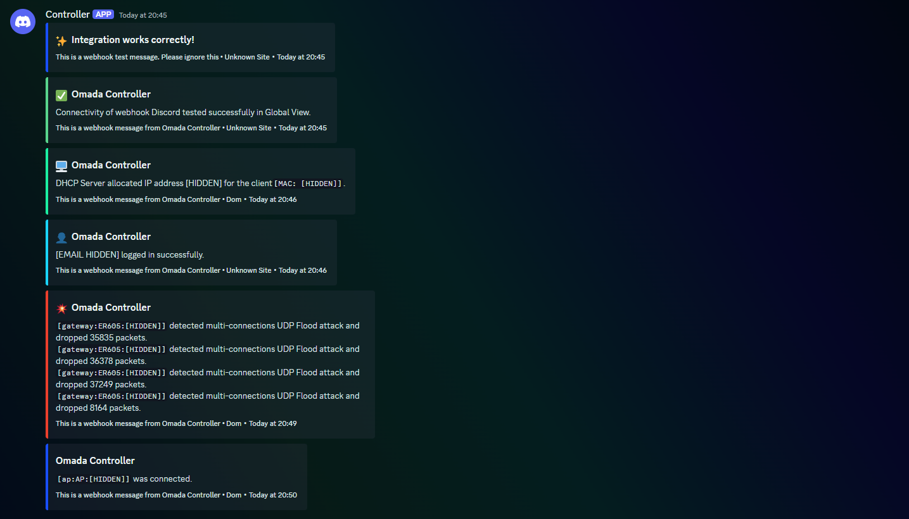

# 🌌 Omada Webhook to Discord
An easy script for integrating Discord Webhooks with the Omada Controller. It allows sending logs from the controller to a selected Discord channel.


*ENABLE_DATA_CENSORING=false*

## Worth Knowing
✅ [Middleware](middlewares/other/verifySecret.js) responsible for verifying the `shardSecret`.  
✅ Ability to enable censorship of sensitive data.  
✅ Built in [Node.js](https://nodejs.org) using the [Express.js](https://www.npmjs.com/package/express) framework.  
✅ Ready [configuration](ecosystem.config.js) for [PM2](https://www.npmjs.com/package/pm2).

## Cloning
```bash
git clone https://github.com/sefinek/Omada-Webhook-to-Discord.git
```

## Endpoint
After running this script, webhooks from your controller should be directed to this endpoint:
```
POST /discord/webhook
```

### Example
```
http://192.168.0.145:8080/discord/webhook
```

## MIT License